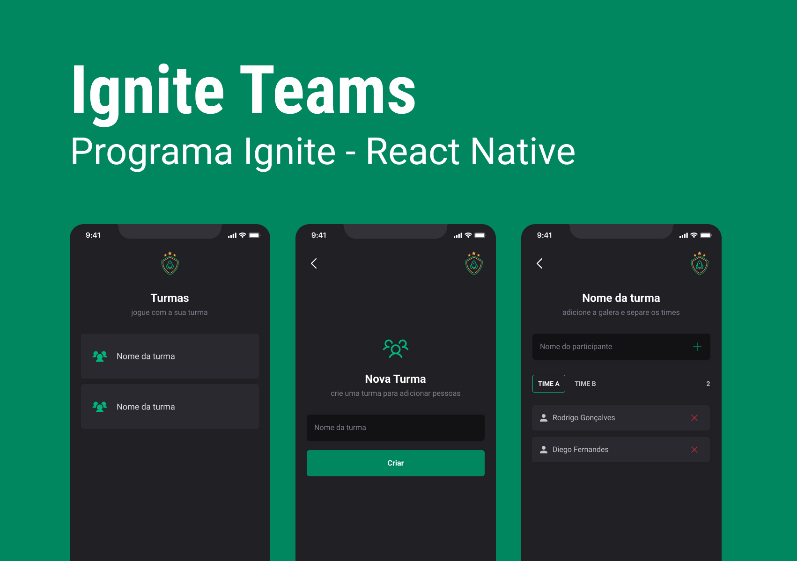

# ignite-teams
<div align='center'>
    
</div>
# 👨🏽‍💻 Stack

- [x] ReactNative
- [x] Typescript
- [x] StyledComponents

## Executando o projeto

Faça o clone deste projeto em seu computador e depois execute com npm:

para rodar o frontend
```bash 
cd ignite-teams
npm install
npx expo start
```
